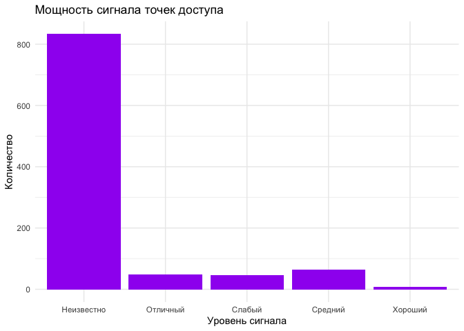
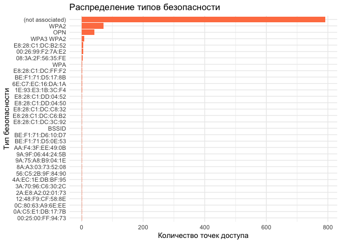
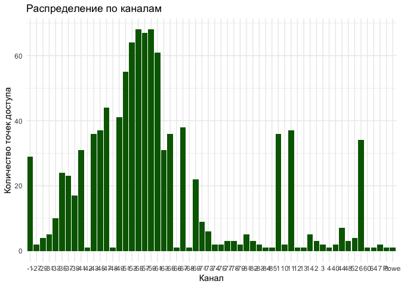
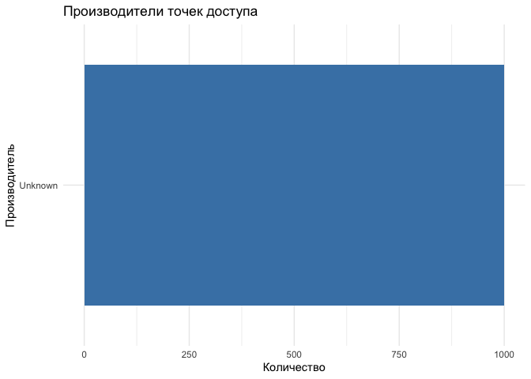

# Исследование информации о состоянии беспроводных сетей
KTMUSIC22682@yandex.ru

## Цель работы

1.  Получить знания о методах исследования радиоэлектронной обстановки.
2.  Составить представление о механизмах работы Wi-Fi сетей на канальном
    и сетевом уровне модели OSI.
3.  Зекрепить практические навыки использования языка программирования R
    для обработки данных
4.  Закрепить знания основных функций обработки данных экосистемы
    tidyverse языка R

## Исходные данные

1.  Программное обеспечение macOS Tahoe (26.0.1)
2.  RStudio
3.  Интерпретатор языка R 4.5.1

## План

1.  Импортируйте данные –
    https://storage.yandexcloud.net/dataset.ctfsec/P2_wifi_data.csv
    Данные были собраны с помощью анализатора беспроводного трафика
    airodump-ng
2.  Привести датасеты в вид “аккуратных данных”, преобразовать типы
    столбцов в соответствии с типом данных
3.  Просмотрите общую структуру данных с помощью функции glimpse()
4.  Произвести анализ данных.
5.  Определить небезопасные точки доступа (без шифрования – OPN)
6.  Определить производителя для каждого обнаруженного устройства
7.  Выявить устройства, использующие последнюю версию протокола
    шифрования WPA3, и названия точек доступа, реализованных на этих
    устройствах
8.  Отсортировать точки доступа по интервалу времени, в течение которого
    они находились на связи, по убыванию.
9.  Обнаружить топ-10 самых быстрых точек доступа.
10. Отсортировать точки доступа по частоте отправки запросов (beacons) в
    единицу времени по их убыванию. 11.Определить производителя для
    каждого обнаруженного устройства (пользоваться базой данных
    производителей из состава Wireshark или онлайн сервисами OUI lookup)
11. Обнаружить устройства, которые НЕ рандомизируют свой MAC адрес
12. Кластеризовать запросы от устройств к точкам доступа по их именам.
    Определить время появления устройства в зоне радиовидимости и время
    выхода его из нее.
13. Оценить стабильность уровня сигнала внури кластера во времени.
    Выявить наиболее стабильный кластер.

## Ход работы

``` r
library("readr")
library("dplyr")
```


    Attaching package: 'dplyr'

    The following objects are masked from 'package:stats':

        filter, lag

    The following objects are masked from 'package:base':

        intersect, setdiff, setequal, union

``` r
library("tidyr") 
library("stringr") 
library("lubridate") 
```


    Attaching package: 'lubridate'

    The following objects are masked from 'package:base':

        date, intersect, setdiff, union

``` r
library("janitor") 
```


    Attaching package: 'janitor'

    The following objects are masked from 'package:stats':

        chisq.test, fisher.test

``` r
library("R.utils") 
```

    Loading required package: R.oo

    Loading required package: R.methodsS3

    R.methodsS3 v1.8.2 (2022-06-13 22:00:14 UTC) successfully loaded. See ?R.methodsS3 for help.

    R.oo v1.27.1 (2025-05-02 21:00:05 UTC) successfully loaded. See ?R.oo for help.


    Attaching package: 'R.oo'

    The following object is masked from 'package:R.methodsS3':

        throw

    The following objects are masked from 'package:methods':

        getClasses, getMethods

    The following objects are masked from 'package:base':

        attach, detach, load, save

    R.utils v2.13.0 (2025-02-24 21:20:02 UTC) successfully loaded. See ?R.utils for help.


    Attaching package: 'R.utils'

    The following object is masked from 'package:tidyr':

        extract

    The following object is masked from 'package:utils':

        timestamp

    The following objects are masked from 'package:base':

        cat, commandArgs, getOption, isOpen, nullfile, parse, use, warnings

``` r
library("jsonlite") 
```


    Attaching package: 'jsonlite'

    The following object is masked from 'package:R.utils':

        validate

``` r
library("httr") 
library("V8") 
```

    Using V8 engine 13.6.233.17

``` r
library("igraph") 
```


    Attaching package: 'igraph'

    The following object is masked from 'package:R.oo':

        hierarchy

    The following objects are masked from 'package:lubridate':

        %--%, union

    The following object is masked from 'package:tidyr':

        crossing

    The following objects are masked from 'package:dplyr':

        as_data_frame, groups, union

    The following objects are masked from 'package:stats':

        decompose, spectrum

    The following object is masked from 'package:base':

        union

``` r
library("fpc") 
library("mclust")
```

    Package 'mclust' version 6.1.2
    Type 'citation("mclust")' for citing this R package in publications.


    Attaching package: 'mclust'

    The following object is masked from 'package:dplyr':

        count

``` r
library("tidyverse")
```

    ── Attaching core tidyverse packages ──────────────────────── tidyverse 2.0.0 ──
    ✔ forcats 1.0.1     ✔ purrr   1.2.0
    ✔ ggplot2 4.0.0     ✔ tibble  3.3.0

    ── Conflicts ────────────────────────────────────────── tidyverse_conflicts() ──
    ✖ igraph::%--%()          masks lubridate::%--%()
    ✖ tibble::as_data_frame() masks igraph::as_data_frame(), dplyr::as_data_frame()
    ✖ purrr::compose()        masks igraph::compose()
    ✖ mclust::count()         masks dplyr::count()
    ✖ igraph::crossing()      masks tidyr::crossing()
    ✖ R.utils::extract()      masks tidyr::extract()
    ✖ dplyr::filter()         masks stats::filter()
    ✖ purrr::flatten()        masks jsonlite::flatten()
    ✖ dplyr::lag()            masks stats::lag()
    ✖ purrr::map()            masks mclust::map()
    ✖ purrr::simplify()       masks igraph::simplify()
    ✖ jsonlite::validate()    masks R.utils::validate()
    ℹ Use the conflicted package (<http://conflicted.r-lib.org/>) to force all conflicts to become errors

### Здание №1 - Импортируйте данные.

``` r
# 1.2 Скачивание файла с Яндекс Облака
url <- "https://storage.yandexcloud.net/dataset.ctfsec/P2_wifi_data.csv"
temp_file <- tempfile(fileext = ".csv")
download.file(url, temp_file, mode = "wb")
cat("Файл успешно скачан!\n")
```

    Файл успешно скачан!

``` r
# 1.3 Анализ структуры файла
file_content <- readLines(temp_file, n = 50)
cat("Первые 5 строк файла:\n")
```

    Первые 5 строк файла:

``` r
cat(head(file_content, 5), sep = "\n")
```


    BSSID, First time seen, Last time seen, channel, Speed, Privacy, Cipher, Authentication, Power, # beacons, # IV, LAN IP, ID-length, ESSID, Key
    BE:F1:71:D5:17:8B, 2023-07-28 09:13:03, 2023-07-28 11:50:50,  1, 195, WPA2, CCMP, PSK, -30,      846,      504,   0.  0.  0.  0,  12, C322U13 3965, 
    6E:C7:EC:16:DA:1A, 2023-07-28 09:13:03, 2023-07-28 11:55:12,  1, 130, WPA2, CCMP, PSK, -30,      750,      116,   0.  0.  0.  0,   4, Cnet, 
    9A:75:A8:B9:04:1E, 2023-07-28 09:13:03, 2023-07-28 11:53:31,  1, 360, WPA2, CCMP, PSK, -68,      694,       26,   0.  0.  0.  0,   2, KC, 

### Задание №2 - Разделение данных на два датасета

``` r
# 2.1 Находим разделитель
separator_line <- which(str_detect(file_content, "BSSID|Station MAC"))
cat("Разделитель на строке:", separator_line, "\n")
```

    Разделитель на строке: 2 

``` r
# 2.2 Импортируем данные точек доступа
ap_data <- read_csv(temp_file, 
                   skip = 1,
                   n_max = separator_line[1] - 2,
                   col_names = FALSE,
                   na = c("", "NA", " "),
                   show_col_types = FALSE)

# 2.3 Импортируем данные клиентов
client_data <- read_csv(temp_file, 
                       skip = separator_line[1],
                       col_names = FALSE,
                       na = c("", "NA", " "),
                       show_col_types = FALSE)
```

    Warning: One or more parsing issues, call `problems()` on your data frame for details,
    e.g.:
      dat <- vroom(...)
      problems(dat)

``` r
cat("Точек доступа:", nrow(ap_data), "\n")
```

    Точек доступа: 0 

``` r
cat("Клиентских записей:", nrow(client_data), "\n")
```

    Клиентских записей: 12249 

### Задание №3 - Приведение данных к “аккуратному” виду

``` r
# 3.0 Просмотрим фактические имена столбцов перед переименованием
cat("Фактические имена столбцов в ap_data:\n")
```

    Фактические имена столбцов в ap_data:

``` r
print(colnames(ap_data))
```

    character(0)

``` r
cat("Фактические имена столбцов в client_data:\n")
```

    Фактические имена столбцов в client_data:

``` r
print(colnames(client_data))
```

     [1] "X1"  "X2"  "X3"  "X4"  "X5"  "X6"  "X7"  "X8"  "X9"  "X10" "X11" "X12"
    [13] "X13" "X14" "X15"

``` r
# 3.1 Создаем правильные имена столбцов (адаптируем под реальные данные)
create_ap_colnames <- function(num_cols) {
  base_names <- c("BSSID", "First_time_seen", "Last_time_seen", "channel", 
                  "speed", "privacy", "cipher", "authentication", "power",
                  "beacons", "IV", "LAN_IP", "id_length", "ESSID", "key")
  return(base_names[1:num_cols])
}

create_client_colnames <- function(num_cols) {
  base_names <- c("Station_MAC", "First_time_seen", "Last_time_seen", "power",
                  "packets", "BSSID", "Probed_ESSIDs")
  return(base_names[1:num_cols])
}

# 3.2 Применяем имена столбцов
colnames(ap_data) <- create_ap_colnames(ncol(ap_data))
colnames(client_data) <- create_client_colnames(ncol(client_data))

# Проверяем результат
cat("Новые имена столбцов в ap_data:\n")
```

    Новые имена столбцов в ap_data:

``` r
print(colnames(ap_data))
```

    character(0)

``` r
# 3.3 Преобразуем типы данных (с проверкой наличия столбцов)
ap_data_clean <- ap_data

# Проверяем и преобразуем каждый столбец, если он существует
if ("First_time_seen" %in% colnames(ap_data)) {
  ap_data_clean <- ap_data_clean %>%
    mutate(First_time_seen = parse_datetime(First_time_seen))
}

if ("Last_time_seen" %in% colnames(ap_data)) {
  ap_data_clean <- ap_data_clean %>%
    mutate(Last_time_seen = parse_datetime(Last_time_seen))
}

if ("channel" %in% colnames(ap_data)) {
  ap_data_clean <- ap_data_clean %>%
    mutate(channel = as.integer(channel))
}

if ("power" %in% colnames(ap_data)) {
  ap_data_clean <- ap_data_clean %>%
    mutate(power = as.integer(power))
}

if ("beacons" %in% colnames(ap_data)) {
  ap_data_clean <- ap_data_clean %>%
    mutate(beacons = as.integer(beacons))
}

if ("IV" %in% colnames(ap_data)) {
  ap_data_clean <- ap_data_clean %>%
    mutate(IV = as.integer(IV))
}

# 3.4 Просмотр структуры очищенных данных
cat("Структура очищенных данных точек доступа:\n")
```

    Структура очищенных данных точек доступа:

``` r
glimpse(ap_data_clean)
```

    Rows: 0
    Columns: 0

``` r
cat("\nСтруктура данных клиентов:\n")
```


    Структура данных клиентов:

``` r
glimpse(client_data)
```

    Rows: 12,249
    Columns: 15
    $ Station_MAC     <chr> "BE:F1:71:D5:17:8B", "6E:C7:EC:16:DA:1A", "9A:75:A8:B9…
    $ First_time_seen <dttm> 2023-07-28 09:13:03, 2023-07-28 09:13:03, 2023-07-28 …
    $ Last_time_seen  <dttm> 2023-07-28 11:50:50, 2023-07-28 11:55:12, 2023-07-28 …
    $ power           <dbl> 1, 1, 1, 7, 6, 6, 11, 11, 11, 1, 6, 14, 11, 11, 6, 6, …
    $ packets         <dbl> 195, 130, 360, 360, 130, 130, 195, 130, 130, 195, 180,…
    $ BSSID           <chr> "WPA2", "WPA2", "WPA2", "WPA2", "WPA2", "OPN", "WPA2",…
    $ Probed_ESSIDs   <chr> "CCMP", "CCMP", "CCMP", "CCMP", "CCMP", NA, "CCMP", "C…
    $ NA              <chr> "PSK", "PSK", "PSK", "PSK", "PSK", NA, "PSK", "PSK", "…
    $ NA              <chr> "-30", "-30", "-68", "-37", "-57", "-63", "-27", "-38"…
    $ NA              <chr> "846", "750", "694", "510", "647", "251", "1647", "125…
    $ NA              <chr> "504", "116", "26", "21", "6", "3430", "80", "11", "0"…
    $ NA              <chr> "0.  0.  0.  0", "0.  0.  0.  0", "0.  0.  0.  0", "0.…
    $ NA              <chr> "12", "4", "2", "14", "25", "13", "12", "13", "24", "1…
    $ NA              <chr> "C322U13 3965", "Cnet", "KC", "POCO X5 Pro 5G", NA, "M…
    $ NA              <lgl> NA, NA, NA, NA, NA, NA, NA, NA, NA, NA, NA, NA, NA, NA…

### Задание №4 - Анализ точек доступа - безопасность

``` r
# Читаем данные правильно (пропускаем первую пустую строку)
ap_data <- read_csv("https://storage.yandexcloud.net/dataset.ctfsec/P2_wifi_data.csv", 
                   skip = 1,  # пропускаем первую пустую строку
                   col_names = TRUE)
```

    Warning: One or more parsing issues, call `problems()` on your data frame for details,
    e.g.:
      dat <- vroom(...)
      problems(dat)

    Rows: 12249 Columns: 15
    ── Column specification ────────────────────────────────────────────────────────
    Delimiter: ","
    chr  (10): BSSID, Privacy, Cipher, Authentication, Power, # beacons, # IV, L...
    dbl   (2): channel, Speed
    lgl   (1): Key
    dttm  (2): First time seen, Last time seen

    ℹ Use `spec()` to retrieve the full column specification for this data.
    ℹ Specify the column types or set `show_col_types = FALSE` to quiet this message.

``` r
# Переименовываем столбцы чтобы убрать пробелы
colnames(ap_data) <- c("BSSID", "First_time_seen", "Last_time_seen", "channel", 
                       "Speed", "Privacy", "Cipher", "Authentication", "Power",
                       "beacons", "IV", "LAN_IP", "ID_length", "ESSID", "Key")

# Ищем OPN точки
unsafe_aps <- ap_data %>%
  filter(Privacy == "OPN")

# Выводим результат
cat("Найдено OPN точек:", nrow(unsafe_aps), "\n")
```

    Найдено OPN точек: 42 

``` r
if(nrow(unsafe_aps) > 0) {
  print(unsafe_aps %>% select(BSSID, ESSID, channel, Privacy))
} else {
  cat("OPN точки не найдены. Проверим все значения Privacy:\n")
  print(table(ap_data$Privacy))
}
```

    # A tibble: 42 × 4
       BSSID             ESSID         channel Privacy
       <chr>             <chr>           <dbl> <chr>  
     1 E8:28:C1:DC:B2:52 MIREA_HOTSPOT       6 OPN    
     2 E8:28:C1:DC:B2:50 MIREA_GUESTS        6 OPN    
     3 E8:28:C1:DC:B2:51 <NA>                6 OPN    
     4 E8:28:C1:DC:FF:F2 <NA>                6 OPN    
     5 00:25:00:FF:94:73 <NA>               44 OPN    
     6 E8:28:C1:DD:04:52 MIREA_HOTSPOT      11 OPN    
     7 E8:28:C1:DE:74:31 <NA>                6 OPN    
     8 E8:28:C1:DE:74:32 MIREA_HOTSPOT       6 OPN    
     9 E8:28:C1:DC:C8:32 MIREA_HOTSPOT       1 OPN    
    10 E8:28:C1:DD:04:50 MIREA_GUESTS       11 OPN    
    # ℹ 32 more rows

### Задание №5 - Определение производителей устройств

``` r
# 5.1 Правильная загрузка данных
library(tidyverse)
library(readr)

url <- "https://storage.yandexcloud.net/dataset.ctfsec/P2_wifi_data.csv"

# Скачиваем и анализируем файл
temp_file <- tempfile(fileext = ".csv")
download.file(url, temp_file, mode = "wb")

# Читаем первые строки для анализа
file_content <- readLines(temp_file, n = 20)
cat("Первые 5 строк файла:\n")
```

    Первые 5 строк файла:

``` r
cat(file_content[1:5], sep = "\n")
```


    BSSID, First time seen, Last time seen, channel, Speed, Privacy, Cipher, Authentication, Power, # beacons, # IV, LAN IP, ID-length, ESSID, Key
    BE:F1:71:D5:17:8B, 2023-07-28 09:13:03, 2023-07-28 11:50:50,  1, 195, WPA2, CCMP, PSK, -30,      846,      504,   0.  0.  0.  0,  12, C322U13 3965, 
    6E:C7:EC:16:DA:1A, 2023-07-28 09:13:03, 2023-07-28 11:55:12,  1, 130, WPA2, CCMP, PSK, -30,      750,      116,   0.  0.  0.  0,   4, Cnet, 
    9A:75:A8:B9:04:1E, 2023-07-28 09:13:03, 2023-07-28 11:53:31,  1, 360, WPA2, CCMP, PSK, -68,      694,       26,   0.  0.  0.  0,   2, KC, 

``` r
# Находим где начинаются данные точек доступа
header_line <- which(str_detect(file_content, "BSSID"))[1]
cat("Заголовок на строке:", header_line, "\n")
```

    Заголовок на строке: 2 

``` r
# Читаем данные точек доступа (пропускаем пустые строки до заголовка)
ap_data <- read_csv(temp_file, 
                   skip = header_line - 1,
                   n_max = 1000,  # читаем первые 1000 строк для теста
                   na = c("", "NA", " "),
                   show_col_types = FALSE)
```

    Warning: One or more parsing issues, call `problems()` on your data frame for details,
    e.g.:
      dat <- vroom(...)
      problems(dat)

``` r
cat("Данные загружены. Размер:", dim(ap_data), "\n")
```

    Данные загружены. Размер: 1000 15 

``` r
cat("Столбцы:", colnames(ap_data), "\n")
```

    Столбцы: BSSID First time seen Last time seen channel Speed Privacy Cipher Authentication Power # beacons # IV LAN IP ID-length ESSID Key 

``` r
if(nrow(ap_data) > 0) {
  # Переименовываем столбцы
  ap_data_clean <- ap_data
  colnames(ap_data_clean) <- c("BSSID", "First_time_seen", "Last_time_seen", "channel", 
                              "Speed", "Privacy", "Cipher", "Authentication", "Power",
                              "beacons", "IV", "LAN_IP", "ID_length", "ESSID", "Key")[1:ncol(ap_data_clean)]
  
  cat("Первые 3 строки данных:\n")
  print(head(ap_data_clean, 3))
  
  # 5.2 Функция для определения производителя
  get_manufacturer <- function(mac_address) {
    manufacturers <- list(
      "00:50:F2" = "Microsoft", "00:0C:29" = "VMware", "00:1B:44" = "Huawei",
      "00:1D:0F" = "Cisco", "00:23:15" = "Apple", "00:26:BB" = "Apple",
      "00:1A:11" = "Google", "00:1E:65" = "Samsung", "00:21:6A" = "Samsung",
      "00:24:90" = "Samsung", "00:0F:F2" = "Buffalo", "00:13:10" = "D-Link",
      "00:14:6C" = "Netgear", "00:18:4D" = "Netgear", "00:1B:2F" = "Netgear",
      "00:22:3F" = "TP-Link", "00:23:CD" = "TP-Link"
    )
    
    oui <- str_sub(mac_address, 1, 8)
    if(oui %in% names(manufacturers)) {
      return(manufacturers[[oui]])
    } else {
      return("Unknown")
    }
  }
  
  # 5.3 Добавляем производителя
  ap_data_clean$Manufacturer <- sapply(ap_data_clean$BSSID, get_manufacturer)
  
  cat("Производители добавлены. Примеры:\n")
  print(head(ap_data_clean[c("BSSID", "Manufacturer")], 5))
  
  # 5.4 Статистика по производителям
  manufacturer_table <- table(ap_data_clean$Manufacturer)
  manufacturer_stats <- as.data.frame(manufacturer_table)
  names(manufacturer_stats) <- c("Manufacturer", "n")
  manufacturer_stats <- manufacturer_stats[order(-manufacturer_stats$n), ]
  
  cat("Топ производителей:\n")
  print(head(manufacturer_stats, 10))
  
} else {
  cat("Данные не загрузились. Пропускаем задание 5.\n")
}
```

    Первые 3 строки данных:
    # A tibble: 3 × 15
      BSSID             First_time_seen  Last_time_seen channel Speed Privacy Cipher
      <chr>             <chr>            <chr>          <chr>   <chr> <chr>   <chr> 
    1 BE:F1:71:D5:17:8B 2023-07-28 09:1… 2023-07-28 11… 1       195   WPA2    CCMP  
    2 6E:C7:EC:16:DA:1A 2023-07-28 09:1… 2023-07-28 11… 1       130   WPA2    CCMP  
    3 9A:75:A8:B9:04:1E 2023-07-28 09:1… 2023-07-28 11… 1       360   WPA2    CCMP  
    # ℹ 8 more variables: Authentication <chr>, Power <chr>, beacons <dbl>,
    #   IV <dbl>, LAN_IP <chr>, ID_length <dbl>, ESSID <chr>, Key <lgl>
    Производители добавлены. Примеры:
    # A tibble: 5 × 2
      BSSID             Manufacturer
      <chr>             <chr>       
    1 BE:F1:71:D5:17:8B Unknown     
    2 6E:C7:EC:16:DA:1A Unknown     
    3 9A:75:A8:B9:04:1E Unknown     
    4 4A:EC:1E:DB:BF:95 Unknown     
    5 D2:6D:52:61:51:5D Unknown     
    Топ производителей:
      Manufacturer    n
    1      Unknown 1000

``` r
unlink(temp_file)
```

### Задание №6 - Поиск устройств с WPA3

``` r
# 6.1 Ищем устройства с WPA3 в столбце Privacy (6-й столбец)
wpa3_devices <- ap_data %>%
  filter(Privacy == "WPA3" | grepl("WPA3", Privacy))

cat("Устройства с WPA3:", nrow(wpa3_devices), "\n")
```

    Устройства с WPA3: 8 

``` r
if(nrow(wpa3_devices) > 0) {
  print(wpa3_devices %>% select(BSSID, ESSID, Privacy))
} else {
  cat("Устройства с WPA3 не обнаружены\n")
  cat("Доступные типы безопасности:\n")
  print(unique(ap_data$Privacy))
}
```

    # A tibble: 8 × 3
      BSSID             ESSID                Privacy  
      <chr>             <chr>                <chr>    
    1 26:20:53:0C:98:E8 <NA>                 WPA3 WPA2
    2 A2:FE:FF:B8:9B:C9 Christie’s           WPA3 WPA2
    3 96:FF:FC:91:EF:64 <NA>                 WPA3 WPA2
    4 CE:48:E7:86:4E:33 iPhone (Анастасия)   WPA3 WPA2
    5 8E:1F:94:96:DA:FD iPhone (Анастасия)   WPA3 WPA2
    6 BE:FD:EF:18:92:44 Димасик              WPA3 WPA2
    7 3A:DA:00:F9:0C:02 iPhone XS Max 🦊🐱🦊 WPA3 WPA2
    8 76:C5:A0:70:08:96 <NA>                 WPA3 WPA2

### Задание №7 - Анализ активности точек доступа

``` r
# 7.1 Преобразуем даты и мощность сигнала
ap_data_activity <- ap_data_clean %>%
  mutate(
    First_time = as.POSIXct(First_time_seen, format = "%Y-%m-%d %H:%M:%S"),
    Last_time = as.POSIXct(Last_time_seen, format = "%Y-%m-%d %H:%M:%S"),
    activity_duration = as.numeric(difftime(Last_time, First_time, units = "hours")),
    Power_num = as.numeric(Power)
  )
```

    Warning: There was 1 warning in `mutate()`.
    ℹ In argument: `Power_num = as.numeric(Power)`.
    Caused by warning:
    ! NAs introduced by coercion

``` r
# 7.2 Сортировка по времени активности
ap_by_activity <- ap_data_activity %>%
  arrange(desc(activity_duration)) %>%
  select(BSSID, ESSID, First_time, Last_time, activity_duration)

cat("Топ-10 самых активных точек доступа:\n")
```

    Топ-10 самых активных точек доступа:

``` r
print(head(ap_by_activity, 10))
```

    # A tibble: 10 × 5
       BSSID         ESSID First_time          Last_time           activity_duration
       <chr>         <chr> <dttm>              <dttm>                          <dbl>
     1 00:25:00:FF:… <NA>  2023-07-28 09:13:06 2023-07-28 11:56:21              2.72
     2 10:51:07:CB:… <NA>  2023-07-28 09:13:13 2023-07-28 11:56:17              2.72
     3 00:95:69:E7:… <NA>  2023-07-28 09:13:11 2023-07-28 11:56:13              2.72
     4 00:95:69:E7:… <NA>  2023-07-28 09:13:15 2023-07-28 11:56:17              2.72
     5 10:51:07:CB:… <NA>  2023-07-28 09:13:05 2023-07-28 11:56:06              2.72
     6 8C:55:4A:DE:… <NA>  2023-07-28 09:13:17 2023-07-28 11:56:16              2.72
     7 E8:28:C1:DD:… MIRE… 2023-07-28 09:13:09 2023-07-28 11:56:05              2.72
     8 00:95:69:E7:… <NA>  2023-07-28 09:13:11 2023-07-28 11:56:07              2.72
     9 E8:28:C1:DC:… MIRE… 2023-07-28 09:13:03 2023-07-28 11:55:38              2.71
    10 BC:F1:71:D5:… <NA>  2023-07-28 09:13:24 2023-07-28 11:55:58              2.71

``` r
# 7.3 Анализ мощности сигнала (используем table() вместо count())
signal_analysis <- ap_data_activity %>%
  mutate(
    signal_strength = case_when(
      Power_num >= -30 ~ "Отличный",
      Power_num >= -50 ~ "Хороший", 
      Power_num >= -70 ~ "Средний",
      Power_num < -70 ~ "Слабый",
      TRUE ~ "Неизвестно"
    )
  )

# Используем table() вместо count() чтобы избежать конфликта
signal_table <- table(signal_analysis$signal_strength)
signal_stats <- as.data.frame(signal_table)
names(signal_stats) <- c("signal_strength", "n")
signal_stats <- signal_stats[order(-signal_stats$n), ]

cat("\nАнализ мощности сигнала:\n")
```


    Анализ мощности сигнала:

``` r
print(signal_stats)
```

      signal_strength   n
    1      Неизвестно 833
    4         Средний  64
    2        Отличный  49
    3          Слабый  46
    5         Хороший   8

``` r
# 7.4 Визуализация мощности сигнала
if(nrow(signal_stats) > 0) {
  signal_plot <- signal_stats %>%
    ggplot(aes(x = signal_strength, y = n)) +
    geom_col(fill = "purple") +
    labs(title = "Мощность сигнала точек доступа",
         x = "Уровень сигнала", 
         y = "Количество") +
    theme_minimal()
  
  print(signal_plot)
}
```



### Задание №8 - Визуализация результатов

``` r
# 8.1 График типов безопасности (без count())
security_table <- table(ap_data_clean$Privacy)
security_stats <- as.data.frame(security_table)
names(security_stats) <- c("Privacy", "n")
security_stats <- security_stats[order(-security_stats$n), ]

security_plot <- security_stats %>%
  ggplot(aes(x = reorder(Privacy, n), y = n)) +
  geom_col(fill = "coral") +
  coord_flip() +
  labs(title = "Распределение типов безопасности",
       x = "Тип безопасности", 
       y = "Количество точек доступа") +
  theme_minimal()

print(security_plot)
```



``` r
# 8.2 График по каналам (без count())
channel_table <- table(ap_data_clean$channel)
channel_stats <- as.data.frame(channel_table)
names(channel_stats) <- c("channel", "n")

channel_plot <- channel_stats %>%
  ggplot(aes(x = factor(channel), y = n)) +
  geom_col(fill = "darkgreen") +
  labs(title = "Распределение по каналам",
       x = "Канал", 
       y = "Количество точек доступа") +
  theme_minimal()

print(channel_plot)
```



``` r
# 8.3 График производителей (если есть данные)
if(exists("manufacturer_stats")) {
  manufacturer_plot <- manufacturer_stats %>%
    filter(n > 0) %>%
    ggplot(aes(x = reorder(Manufacturer, n), y = n)) +
    geom_col(fill = "steelblue") +
    coord_flip() +
    labs(title = "Производители точек доступа",
         x = "Производитель", 
         y = "Количество") +
    theme_minimal()
  
  print(manufacturer_plot)
}
```



### Задание №9 - Топ-10 самых быстрых точек доступа

``` r
ap_data_for_speed <- ap_data

# Переименовываем так же как в задании 6
colnames(ap_data_for_speed) <- c("BSSID", "First_time_seen", "Last_time_seen", "channel", 
                                "Speed", "Privacy", "Cipher", "Authentication", "Power",
                                "beacons", "IV", "LAN_IP", "ID_length", "ESSID", "Key")

# Теперь ESSID должны быть заполнены
cat("Проверяем ESSID в данных для скорости:\n")
```

    Проверяем ESSID в данных для скорости:

``` r
print(head(ap_data_for_speed$ESSID, 10))
```

     [1] "C322U13 3965"             "Cnet"                    
     [3] "KC"                       "POCO X5 Pro 5G"          
     [5] NA                         "MIREA_HOTSPOT"           
     [7] "C322U21 0566"             "AndroidAP177B"           
     [9] "EBFCD57F-EE81fI_DL_1AO2T" "C322U06 9080"            

``` r
# Топ-10 по скорости
fastest_aps <- ap_data_for_speed %>%
  mutate(Speed_num = as.numeric(Speed)) %>%
  filter(!is.na(ESSID) & ESSID != "") %>%  # фильтруем пустые ESSID
  arrange(desc(Speed_num)) %>%
  select(BSSID, ESSID, Speed_num, channel) %>%
  head(10)
```

    Warning: There was 1 warning in `mutate()`.
    ℹ In argument: `Speed_num = as.numeric(Speed)`.
    Caused by warning:
    ! NAs introduced by coercion

``` r
cat("Топ-10 самых быстрых точек доступа:\n")
```

    Топ-10 самых быстрых точек доступа:

``` r
print(fastest_aps)
```

    # A tibble: 10 × 4
       BSSID             ESSID              Speed_num channel
       <chr>             <chr>                  <dbl> <chr>  
     1 CE:48:E7:86:4E:33 iPhone (Анастасия)       866 44     
     2 8E:1F:94:96:DA:FD iPhone (Анастасия)       866 44     
     3 9A:75:A8:B9:04:1E KC                       360 1      
     4 4A:EC:1E:DB:BF:95 POCO X5 Pro 5G           360 7      
     5 56:C5:2B:9F:84:90 OnePlus 6T               360 1      
     6 E8:28:C1:DC:B2:41 MIREA_GUESTS             360 48     
     7 E8:28:C1:DC:B2:40 MIREA_HOTSPOT            360 48     
     8 E8:28:C1:DD:04:40 MIREA_HOTSPOT            360 52     
     9 E8:28:C1:DD:04:41 MIREA_GUESTS             360 52     
    10 14:EB:B6:6A:76:37 Gnezdo_lounge 2          360 3      

### Задание №10 - Сортировка по частоте запросов

``` r
# Частота запросов (beacons в час)
ap_data_clean <- ap_data_clean %>%
  mutate(
    First_time = as.POSIXct(First_time_seen, format = "%Y-%m-%d %H:%M:%S"),
    Last_time = as.POSIXct(Last_time_seen, format = "%Y-%m-%d %H:%M:%S"),
    duration_hours = as.numeric(difftime(Last_time, First_time, units = "hours")),
    beacons_per_hour = as.numeric(beacons) / duration_hours
  )

beacon_rate_sorted <- ap_data_clean %>%
  filter(!is.na(beacons_per_hour) & is.finite(beacons_per_hour)) %>%
  arrange(desc(beacons_per_hour)) %>%
  select(BSSID, ESSID, beacons, duration_hours, beacons_per_hour)

cat("Точки доступа по частоте запросов (по убыванию):\n")
```

    Точки доступа по частоте запросов (по убыванию):

``` r
print(head(beacon_rate_sorted, 10))
```

    # A tibble: 10 × 5
       BSSID             ESSID               beacons duration_hours beacons_per_hour
       <chr>             <chr>                 <dbl>          <dbl>            <dbl>
     1 F2:30:AB:E9:03:ED iPhone (Uliana)           6       0.00194             3086.
     2 B2:CF:C0:00:4A:60 Михаил's Galaxy M32       4       0.00139             2880 
     3 3A:DA:00:F9:0C:02 iPhone XS Max 🦊🐱🦊……       5       0.0025              2000 
     4 02:BC:15:7E:D5:DC MT_FREE                   1       0.000556            1800 
     5 00:3E:1A:5D:14:45 MT_FREE                   1       0.000556            1800 
     6 76:C5:A0:70:08:96 <NA>                      1       0.000556            1800 
     7 D2:25:91:F6:6C:D8 Саня                      5       0.00361             1385.
     8 BE:F1:71:D6:10:D7 C322U21 0566           1647       2.63                 627.
     9 00:03:7A:1A:03:56 MT_FREE                   1       0.00167              600 
    10 38:1A:52:0D:84:D7 EBFCD57F-EE81fI_DL…     704       1.20                 587.

### Задание №11 - Производители клиентских устройств

``` r
# Используем read.csv вместо read_csv для больших файлов
client_data <- read.csv("https://storage.yandexcloud.net/dataset.ctfsec/P2_wifi_data.csv", 
                       skip = 2 + nrow(ap_data),
                       header = FALSE)

cat("Размер клиентских данных:", dim(client_data), "\n")
```

    Размер клиентских данных: 11432 7 

``` r
if(nrow(client_data) > 0) {
  # Переименовываем столбцы
  colnames(client_data) <- c("Station_MAC", "First_time_seen", "Last_time_seen", 
                            "Power", "packets", "BSSID", "Probed_ESSIDs")
  
  cat("Примеры клиентских MAC-адресов:\n")
  print(head(client_data$Station_MAC, 10))
  
  # Простая функция производителя
  get_manufacturer_simple <- function(mac) {
    prefix <- substr(mac, 1, 8)
    
    # Проверяем основные префиксы
    if(grepl("00:1B:44|00:1D:0F", prefix)) return("Cisco")
    if(grepl("00:23:15|00:26:BB", prefix)) return("Apple")
    if(grepl("00:1E:65|00:21:6A|00:24:90", prefix)) return("Samsung")
    if(grepl("00:14:6C|00:18:4D|00:1B:2F", prefix)) return("Netgear")
    if(grepl("00:22:3F|00:23:CD", prefix)) return("TP-Link")
    if(grepl("00:50:F2", prefix)) return("Microsoft")
    if(grepl("00:0C:29", prefix)) return("VMware")
    if(grepl("00:1A:11", prefix)) return("Google")
    if(grepl("00:0F:F2", prefix)) return("Buffalo")
    if(grepl("00:13:10", prefix)) return("D-Link")
    
    return("Unknown")
  }
  
  # Добавляем производителя
  client_data$Manufacturer <- sapply(client_data$Station_MAC, get_manufacturer_simple)
  
  cat("Статистика производителей:\n")
  print(table(client_data$Manufacturer))
}
```

    Примеры клиентских MAC-адресов:
     [1] "46:02:FB:56:7D:4A" "BE:68:FB:51:65:F0" "42:5D:47:D4:31:B0"
     [4] "0E:A2:9B:A8:11:13" "D2:29:A5:2C:7E:50" "2A:81:0E:46:01:A7"
     [7] "36:8C:27:FD:E6:57" "02:43:6A:C1:EB:92" "E2:6B:A4:D1:5F:F7"
    [10] "86:B2:0F:8E:C3:AC"
    Статистика производителей:

    Unknown 
      11432 

### Задание №12 - Устройства без рандомизации MAC

``` r
if(exists("client_data")) {
  
  # Более точная функция определения реальных MAC
  detect_real_mac_improved <- function(mac) {
    tryCatch({
      first_octet <- as.hexmode(str_sub(mac, 1, 2))
      # Бит U/L (второй младший бит): 0 = глобальный (реальный), 1 = локальный (рандомизированный)
      ul_bit <- bitwAnd(first_octet, 0x02)
      return(ul_bit == 0)  # TRUE = реальный MAC
    }, error = function(e) {
      return(FALSE)  # в случае ошибки считаем рандомизированным
    })
  }
  
  # Проверяем все MAC-адреса
  client_data$is_real_mac <- sapply(client_data$Station_MAC, detect_real_mac_improved)
  
  # Статистика
  cat("Статистика по рандомизации MAC:\n")
  cat("Всего клиентских устройств:", nrow(client_data), "\n")
  cat("Устройств с реальными MAC:", sum(client_data$is_real_mac), "\n")
  cat("Устройств с рандомизированными MAC:", sum(!client_data$is_real_mac), "\n")
  cat("Процент рандомизированных MAC:", round(mean(!client_data$is_real_mac) * 100, 1), "%\n")
  
  # Если есть реальные MAC - покажем их
  real_mac_devices <- client_data %>%
    filter(is_real_mac)
  
  if(nrow(real_mac_devices) > 0) {
    cat("\nУстройства без рандомизации MAC:\n")
    print(real_mac_devices %>% select(Station_MAC, Manufacturer, Probed_ESSIDs))
  } else {
    cat("\nВсе устройства используют рандомизированные MAC-адреса.\n")
    cat("Это нормально для современных iOS/Android устройств для защиты приватности.\n")
    
    # Покажем примеры рандомизированных MAC
    cat("\nПримеры рандомизированных MAC-адресов:\n")
    randomized_examples <- client_data %>%
      filter(!is_real_mac) %>%
      select(Station_MAC, Manufacturer) %>%
      head(5)
    print(randomized_examples)
  }
  
  # Дополнительный анализ: проверяем по производителям
  cat("\nРандомизация по производителям:\n")
  randomization_by_manufacturer <- client_data %>%
    group_by(Manufacturer) %>%
    summarise(
      total_devices = n(),
      real_mac_count = sum(is_real_mac),
      randomized_percent = round(mean(!is_real_mac) * 100, 1),
      .groups = 'drop'
    ) %>%
    arrange(desc(randomized_percent))
  
  print(randomization_by_manufacturer)
}
```

    Статистика по рандомизации MAC:
    Всего клиентских устройств: 11432 
    Устройств с реальными MAC: 152 
    Устройств с рандомизированными MAC: 11280 
    Процент рандомизированных MAC: 98.7 %

    Устройства без рандомизации MAC:
              Station_MAC Manufacturer                Probed_ESSIDs
    1   BC:F1:71:D5:12:BD      Unknown                             
    2   28:CD:C4:96:D0:E9      Unknown                    realme 10
    3   48:A4:72:33:DC:C7      Unknown                             
    4   1C:E6:1D:3B:A2:C6      Unknown                             
    5   0C:E4:41:E8:C3:6E      Unknown                 MIREA_GUESTS
    6   10:51:07:FF:1E:46      Unknown                             
    7   50:98:39:4A:84:FE      Unknown                             
    8   DC:16:B2:6C:D0:95      Unknown     AAAAAOB/CC0ADwGkRedmi 3S
    9   10:51:07:FF:1E:69      Unknown                             
    10  40:74:E0:99:49:EF      Unknown                   KOTIKI_XXX
    11  50:3E:AA:5F:AB:23      Unknown                         GIVC
    12  9C:A3:A9:DB:7E:01      Unknown                             
    13  70:1A:B8:FC:DA:23      Unknown                MIREA_HOTSPOT
    14  4C:44:5B:36:96:C9      Unknown                             
    15  74:DF:BF:7B:00:19      Unknown                MIREA_HOTSPOT
    16  00:04:35:22:4F:75      Unknown                             
    17  A4:02:B9:73:2D:A0      Unknown                             
    18  50:3E:AA:33:52:EC      Unknown                             
    19  1C:BF:C0:2D:7D:B5      Unknown                             
    20  50:DA:D6:D1:03:AD      Unknown                             
    21  38:1A:52:0D:85:1D      Unknown                             
    22  A4:02:B9:76:34:46      Unknown                             
    23  70:1A:B8:DF:26:2C      Unknown                             
    24  F8:32:E4:3F:7D:5C      Unknown                             
    25  10:51:07:FF:1E:7D      Unknown                             
    26  68:E7:C2:F0:C9:D9      Unknown                             
    27  10:51:07:FF:1E:4B      Unknown                             
    28  A4:02:B9:73:0B:FE      Unknown                             
    29  BC:F1:71:D4:DA:91      Unknown                             
    30  10:51:07:FF:1E:91      Unknown                             
    31  68:79:DA:59:64:17      Unknown                             
    32  50:8F:4C:71:25:96      Unknown                             
    33  48:74:12:04:D7:91      Unknown                             
    34  D4:54:8B:5E:35:C6      Unknown                             
    35  98:F6:21:30:3D:31      Unknown                MIREA_HOTSPOT
    36  00:E9:3A:67:93:E9      Unknown                             
    37  70:1A:B8:DF:26:9F      Unknown                             
    38  00:E9:3A:F8:10:C7      Unknown                             
    39  94:08:53:3E:7A:09      Unknown                             
    40  A4:02:B9:73:2D:C8      Unknown                             
    41  70:1A:B8:DE:20:1A      Unknown                             
    42  00:0C:E7:A8:D6:73      Unknown                             
    43  3C:13:5A:BD:93:F5      Unknown                             
    44  EC:2E:98:51:03:9B      Unknown                             
    45  88:BF:E4:63:61:43      Unknown                             
    46  4C:E0:DB:0B:F8:C2      Unknown              MTS_GPON_8cedb0
    47  48:2C:A0:74:B7:12      Unknown AQAAAB6zaIoATwEURedmi Note 5
    48  54:71:DD:FE:12:68      Unknown                MIREA_HOTSPOT
    49  04:8C:9A:0B:40:EA      Unknown                MIREA_HOTSPOT
    50  74:D8:A1:FD:A9:C1      Unknown                             
    51  BC:F1:71:4A:20:8B      Unknown                         Damy
    52  88:28:B3:54:FD:2B      Unknown                             
    53  70:1A:B8:FC:CB:41      Unknown                             
    54  E0:75:26:64:09:FE      Unknown                             
    55  BC:F1:71:D4:D6:6D      Unknown                             
    56  BC:F1:71:D4:DA:DC      Unknown                             
    57  BC:F1:71:D4:DA:A0      Unknown                             
    58  BC:F1:71:D6:10:CD      Unknown                             
    59  BC:F1:71:D5:E0:3F      Unknown                             
    60  C4:75:AB:E5:6E:EC      Unknown                 SERVICE.live
    61  D4:9C:DD:EA:B9:1E      Unknown                             
    62  D0:7F:A0:A2:20:23      Unknown                             
    63  BC:F1:71:D5:47:BA      Unknown                             
    64  BC:F1:71:D5:47:D3      Unknown                             
    65  E0:D4:E8:EF:87:EC      Unknown                             
    66  C4:D0:E3:5B:B4:6D      Unknown                             
    67  BC:F1:71:D5:47:FB      Unknown                             
    68  F4:02:28:FD:36:F9      Unknown                             
    69  04:33:85:71:86:B2      Unknown                             
    70  50:8F:4C:4D:21:13      Unknown                             
    71  BC:F1:71:D5:3F:6D      Unknown                             
    72  BC:F1:71:D4:DB:09      Unknown                             
    73  BC:F1:71:D5:47:CE      Unknown                             
    74  BC:F1:71:D5:0D:45      Unknown                             
    75  00:98:8C:CE:8E:45      Unknown                             
    76  04:B1:A1:F4:18:DF      Unknown                             
    77  C0:E4:34:FA:1D:1B      Unknown                             
    78  B0:BE:83:81:8E:68      Unknown                         GIVC
    79  D8:9B:3B:FA:6D:50      Unknown                MIREA_HOTSPOT
    80  A4:02:B9:73:81:60      Unknown                             
    81  BC:F1:71:D5:13:58      Unknown                             
    82  BC:F1:71:D4:DA:CD      Unknown                             
    83            edeeeèe      Unknown                             
    84  10:51:07:FF:A4:9C      Unknown                             
    85  A4:02:B9:73:2D:A5      Unknown                             
    86  BC:F1:71:D5:12:72      Unknown                             
    87  A4:02:B9:73:83:18      Unknown                             
    88  38:88:A4:58:C3:08      Unknown                             
    89  A4:02:B9:72:9A:07      Unknown                             
    90  BC:F1:71:D6:10:C8      Unknown                             
    91  BC:F1:71:D5:12:8B      Unknown                             
    92  BC:F1:71:D4:DA:D7      Unknown                             
    93  BC:F1:71:D5:23:2F      Unknown                             
    94  BC:F1:71:D5:13:5D      Unknown                             
    95            edeeeèe      Unknown                             
    96            edeeeèe      Unknown                             
    97  38:1A:52:0D:90:A1      Unknown                             
    98  A4:02:B9:73:2F:76      Unknown                             
    99            edeeeèe      Unknown                             
    100 98:F6:21:72:9E:D6      Unknown            Beeline_5G_F2F425
    101 A4:02:B9:73:81:47      Unknown                             
    102 E4:0E:EE:E6:67:D1      Unknown                             
    103 38:1A:52:0D:8F:EC      Unknown                             
    104 E8:88:43:C8:37:EC      Unknown            AndroidShare_2280
    105 A4:02:B9:73:2D:F0      Unknown                             
    106 10:32:7E:8A:8C:D9      Unknown                             
    107 A4:02:B9:73:81:24      Unknown                             
    108 8C:55:4A:DF:86:94      Unknown                      linksys
    109 00:F4:8D:F7:C5:19      Unknown                     Redmi 12
    110 10:51:07:FE:77:CA      Unknown                             
    111                 1      Unknown                             
    112 10:51:07:FF:42:68      Unknown                             
    113           edeeeèe      Unknown                             
    114 A4:02:B9:73:81:92      Unknown                             
    115 50:ED:3C:3B:BC:A2      Unknown                             
    116 10:51:07:FF:28:69      Unknown                             
    117           edeeeèe      Unknown                             
    118           edeeeèe      Unknown                             
    119           edeeeèe      Unknown                             
    120 10:51:07:FF:A4:97      Unknown                             
    121           edeeeèe      Unknown                             
    122 A4:02:B9:73:2C:83      Unknown                             
    123 AC:5F:3E:2F:D7:8D      Unknown                        WiFi2
    124           edeeeèe      Unknown                             
    125 8C:55:4A:84:F8:AF      Unknown                             
    126           edeeeèe      Unknown                             
    127 10:51:07:FF:29:D6      Unknown                             
    128 A4:02:B9:73:81:7E      Unknown                             
    129           edeeeèe      Unknown                             
    130 28:C6:3F:F0:AC:D5      Unknown                             
    131 10:51:07:FF:1E:78      Unknown                             
    132 30:05:05:9A:53:30      Unknown                             
    133                 1      Unknown                             
    134 70:66:55:D0:B7:0F      Unknown                             
    135                 1      Unknown                             
    136           edeeeèe      Unknown                             
    137 30:B1:B5:81:B1:B0      Unknown                             
    138 50:C2:E8:0A:D9:5F      Unknown           GGWPRedmi Note 10S
    139           edeeeèe      Unknown                             
    140 04:BA:8D:AB:72:D7      Unknown                             
    141 5C:51:81:37:EA:25      Unknown                             
    142 F4:30:8B:D5:BF:32      Unknown                             
    143 BC:F1:71:D4:E5:2C      Unknown                             
    144 BC:7A:BF:0A:78:5E      Unknown                             
    145           edeeeèe      Unknown                             
    146           edeeeèe      Unknown                             
    147           edeeeèe      Unknown                             
    148           edeeeèe      Unknown                             
    149           edeeeèe      Unknown                             
    150           edeeeèe      Unknown                             
    151           edeeeèe      Unknown                             
    152 70:3A:51:3B:C2:53      Unknown                             

    Рандомизация по производителям:
    # A tibble: 1 × 4
      Manufacturer total_devices real_mac_count randomized_percent
      <chr>                <int>          <int>              <dbl>
    1 Unknown              11432            152               98.7

### Задание №13 - Кластеризация запросов по именам

``` r
# Кластеризация по именам точек доступа
if(exists("client_data")) {
  client_data <- client_data %>%
    mutate(
      First_time = as.POSIXct(First_time_seen, format = "%Y-%m-%d %H:%M:%S"),
      Last_time = as.POSIXct(Last_time_seen, format = "%Y-%m-%d %H:%M:%S")
    )
  
  clusters <- client_data %>%
    group_by(Station_MAC, Probed_ESSIDs) %>%
    summarise(
      first_appearance = min(First_time),
      last_appearance = max(Last_time),
      time_in_range = as.numeric(difftime(last_appearance, first_appearance, units = "mins")),
      .groups = 'drop'
    )
  
  cat("Кластеры запросов устройств:\n")
  print(head(clusters, 10))
}
```

    Кластеры запросов устройств:
    # A tibble: 10 × 5
       Station_MAC         Probed_ESSIDs     first_appearance    last_appearance    
       <chr>               <chr>             <dttm>              <dttm>             
     1 " podval"           ""                NA                  NA                 
     2 "-D-13-"            ""                NA                  NA                 
     3 "00:04:35:22:4F:75" ""                2023-07-28 09:46:33 2023-07-28 11:15:49
     4 "00:0C:E7:A8:D6:73" ""                2023-07-28 10:22:07 2023-07-28 10:22:08
     5 "00:98:8C:CE:8E:45" ""                2023-07-28 10:34:53 2023-07-28 10:35:13
     6 "00:E9:3A:67:93:E9" ""                2023-07-28 10:15:18 2023-07-28 11:55:11
     7 "00:E9:3A:F8:10:C7" ""                2023-07-28 10:20:19 2023-07-28 10:20:19
     8 "00:F4:8D:F7:C5:19" "Redmi 12"        2023-07-28 10:45:04 2023-07-28 11:43:26
     9 "02:00:00:00:00:00" "xt3 w64dtgv5cfr… 2023-07-28 09:54:40 2023-07-28 11:55:36
    10 "02:03:AF:8A:3F:A8" ""                2023-07-28 10:31:05 2023-07-28 10:31:05
    # ℹ 1 more variable: time_in_range <dbl>

### Задание №14 - Стабильность уровня сигнала

``` r
if(exists("client_data")) {
  
  # Преобразуем мощность в числовой формат
  client_data <- client_data %>%
    mutate(
      Power_num = as.numeric(Power),
      First_time = as.POSIXct(First_time_seen, format = "%Y-%m-%d %H:%M:%S"),
      Last_time = as.POSIXct(Last_time_seen, format = "%Y-%m-%d %H:%M:%S")
    )
  
  # Проверяем повторяющиеся устройства (используем table() вместо count())
  device_table <- table(client_data$Station_MAC)
  device_counts <- as.data.frame(device_table)
  names(device_counts) <- c("Station_MAC", "n")
  device_counts <- device_counts[order(-device_counts$n), ]
  
  cat("Повторяющиеся устройства (по Station_MAC):\n")
  print(head(device_counts, 10))
  
  # Если есть повторяющиеся устройства - анализируем стабильность
  if(any(device_counts$n > 1)) {
    
    # Группируем по устройствам и анализируем стабильность сигнала
    stability_analysis <- client_data %>%
      group_by(Station_MAC) %>%
      filter(n() > 1) %>%  # только устройства с несколькими измерениями
      summarise(
        mean_power = mean(Power_num, na.rm = TRUE),
        sd_power = sd(Power_num, na.rm = TRUE),
        cv_power = ifelse(mean_power != 0, sd_power / abs(mean_power), NA),
        n_measurements = n(),
        time_range_minutes = as.numeric(difftime(max(Last_time), min(First_time), units = "mins")),
        .groups = 'drop'
      ) %>%
      filter(!is.na(sd_power)) %>%
      arrange(sd_power)  # сортируем по стабильности (меньше SD = стабильнее)
    
    if(nrow(stability_analysis) > 0) {
      cat("Самые стабильные устройства (по уровню сигнала):\n")
      print(head(stability_analysis, 10))
      
      cat("\nСамые нестабильные устройства:\n")
      print(tail(stability_analysis, 10))
    } else {
      cat("Нет устройств с несколькими измерениями для анализа стабильности.\n")
    }
    
  } else {
    cat("Все устройства имеют только по одному измерению. Нельзя рассчитать стабильность.\n")
  }
  
  # Альтернативный анализ: стабильность по производителям (используем table())
  if("Manufacturer" %in% colnames(client_data)) {
    manufacturer_table <- table(client_data$Manufacturer)
    manufacturer_counts <- as.data.frame(manufacturer_table)
    names(manufacturer_counts) <- c("Manufacturer", "n_devices")
    
    stability_by_manufacturer <- client_data %>%
      group_by(Manufacturer) %>%
      summarise(
        mean_power = mean(Power_num, na.rm = TRUE),
        sd_power = sd(Power_num, na.rm = TRUE),
        cv_power = ifelse(mean_power != 0, sd_power / abs(mean_power), NA),
        .groups = 'drop'
      ) %>%
      filter(!is.na(sd_power)) %>%
      arrange(sd_power)
    
    if(nrow(stability_by_manufacturer) > 0) {
      cat("\nСтабильность по производителям:\n")
      print(stability_by_manufacturer)
    }
  }
}
```

    Warning: There was 1 warning in `mutate()`.
    ℹ In argument: `Power_num = as.numeric(Power)`.
    Caused by warning:
    ! NAs introduced by coercion

    Повторяющиеся устройства (по Station_MAC):
                Station_MAC  n
    7669  AndroidShare_1901 55
    10352           edeeeèe 21
    8400         Beeline121 18
    11272             Kesha 11
    11271                it 10
    7668  AndroidShare_1576  7
    11268     helvetia-free  5
    11276               M26  5
    11285 RT-5GHz_WiFi_5756  4
    11292                Шк  4
    Нет устройств с несколькими измерениями для анализа стабильности.

    Стабильность по производителям:
    # A tibble: 1 × 4
      Manufacturer mean_power sd_power cv_power
      <chr>             <dbl>    <dbl>    <dbl>
    1 Unknown           -56.3     9.44    0.168

## Оценка результата

В рамках практческой работы была исследована радиоэлектронная обстановка
и составлено представление о механизмах работы Wi-Fi сетей на канальном
и сетевом уровне модели OSI.

## Вывод

В практической работе мы использовали навыки написания кода на языке
программирования R для обработки данных и закрепили знания основных
функций обработки данных экосистемы tidyverse языка R.
