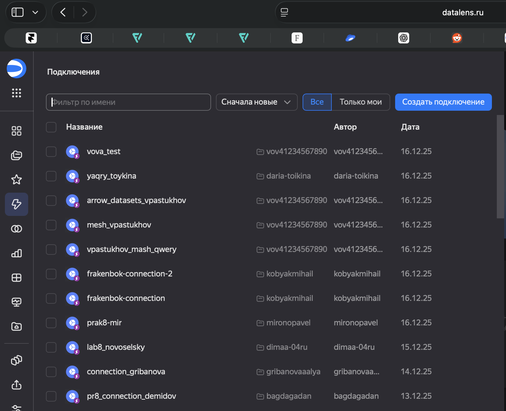
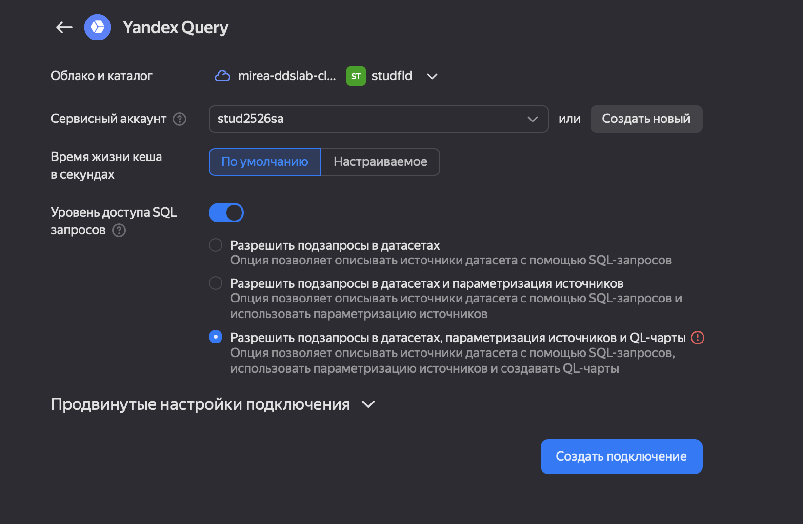
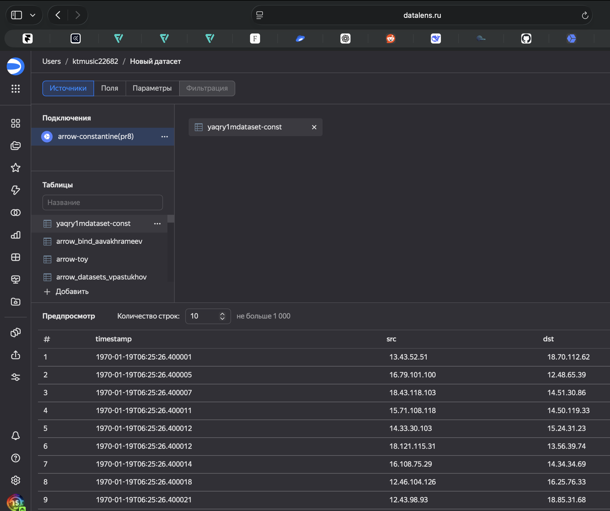
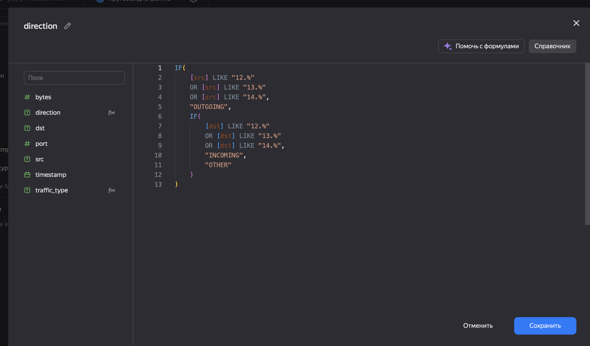
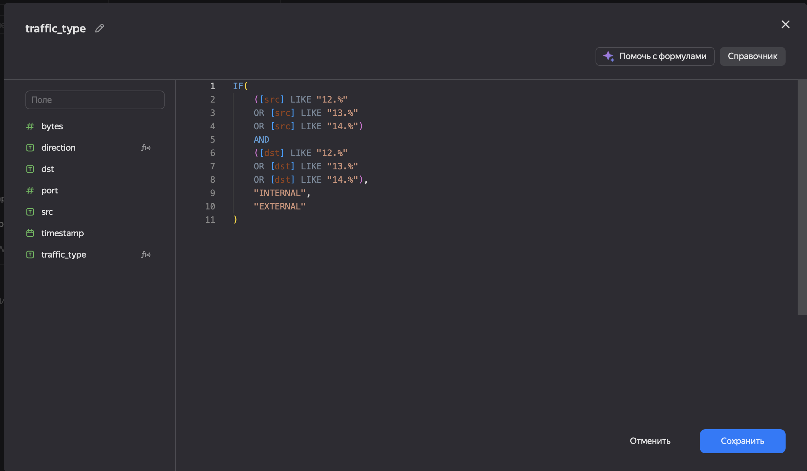
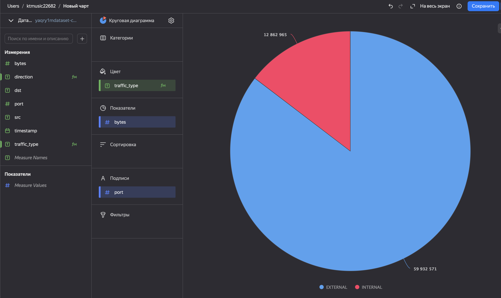
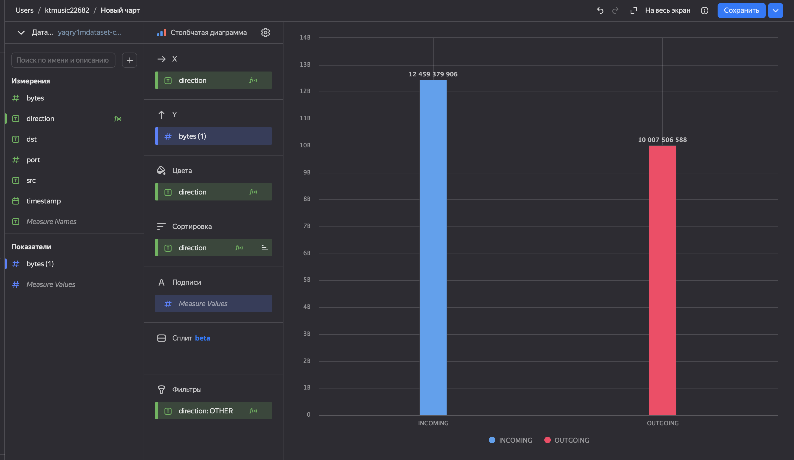
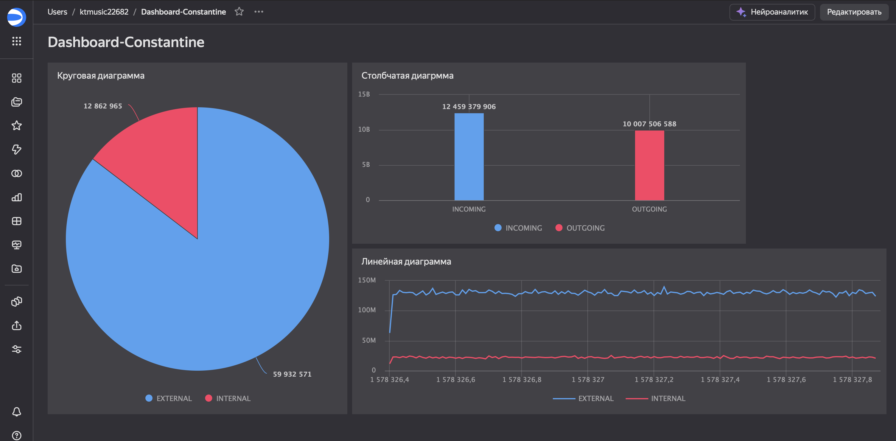

# Использование технологии Yandex DataLens для анализа данных сетевой
активности
KTMUSIC22682@yandex.ru

## Цель работы

1.  Изучить возможности технологии Yandex DataLens для визуального
    анализа структурированных наборов данных
2.  Получить навыки визуализации данных для последующего анализа с
    помощью сервисов Yandex Cloud
3.  Получить навыки создания решений мониторинга/SIEM на базе облачных
    продуктов и открытых программных решений
4.  Закрепить практические навыки использования SQL для анализа данных
    сетевой активности в сегментированной корпоративной сети

## Исходные данные

1.  Программное обеспечение macOS Tahoe (26.0.1)
2.  RStudio
3.  Интерпретатор языка R 4.5.1

## Ход работы

``` r
sessionInfo()
```

    R version 4.5.1 (2025-06-13)
    Platform: aarch64-apple-darwin20
    Running under: macOS Tahoe 26.1

    Matrix products: default
    BLAS:   /Library/Frameworks/R.framework/Versions/4.5-arm64/Resources/lib/libRblas.0.dylib 
    LAPACK: /Library/Frameworks/R.framework/Versions/4.5-arm64/Resources/lib/libRlapack.dylib;  LAPACK version 3.12.1

    locale:
    [1] en_US.UTF-8/en_US.UTF-8/en_US.UTF-8/C/en_US.UTF-8/en_US.UTF-8

    time zone: Europe/Moscow
    tzcode source: internal

    attached base packages:
    [1] stats     graphics  grDevices utils     datasets  methods   base     

    loaded via a namespace (and not attached):
     [1] compiler_4.5.1    fastmap_1.2.0     cli_3.6.5         tools_4.5.1      
     [5] htmltools_0.5.8.1 rstudioapi_0.17.1 yaml_2.3.10       rmarkdown_2.29   
     [9] knitr_1.50        jsonlite_2.0.0    xfun_0.53         digest_0.6.37    
    [13] rlang_1.1.6       evaluate_1.0.5   

### Yandex DataLens



### Создание подключения



### Добавление таблицы из прошлой практики

 \### Задание №1 - Представить в виде
круговой диаграммы соотношение внешнего и внутреннего сетевого трафика.
\#### Создание поля direction для первой круговой диаграммы


#### Создание поля traffic_type



#### Круговая диаграмма

 \### Задание №2 - Представить в виде
столбчатой диаграммы соотношение входящего и исходящего трафика из
внутреннего сетвого сегмента. \#### Аналогичным образом строим
столбчатую диаграмму 

### Задание №3 - Построить график активности (линейная диаграмма) объема трафика во времени.

#### Линейная диаграмма

 \### Задание №4 - Все построенные
графики вывести в виде единого дашборда в Yandex DataLens. \####
Итоговый дашборд 

#### Ссылка на дашборд - https://datalens.ru/uetsmzab8krke-dashboard-constantine

## Оценка результатов

Анализ сетевого трафика позволил успешно сегментировать данные на
внутренний и внешний трафик на основе заданного диапазона IP-адресов.
Соотношение объёмов демонстрирует преобладание внутреннего сетевого
обмена, что указывает на высокую степень взаимодействия между узлами
выделенного сегмента. Визуализация по времени чётко отражает суточные
циклы активности с выраженными пиками в рабочие часы, подтверждая
корректность применённых методов фильтрации и агрегации.

## Вывод

Исследование подтвердило возможность эффективного анализа сетевой
активности с использованием инструментов Yandex Query и DataLens.
Полученные графики наглядно показывают структуру трафика и его динамику,
что может служить основой для сетевого планирования и мониторинга.
Инструменты позволяют оперативно выявлять аномалии и оценивать нагрузку
на сегменты сети, что является ценным для администраторов и аналитиков.
